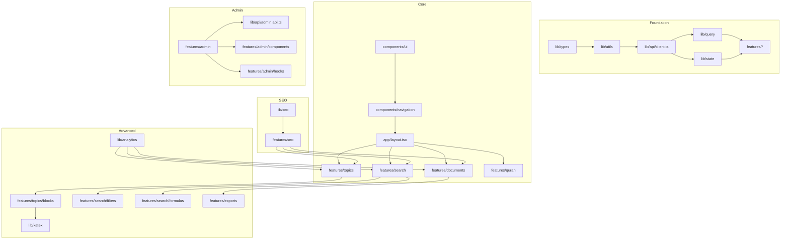

# SIJIL Dependency Graph

## Overview

This document visualizes and documents all dependencies between modules, features, phases, and tasks in the SIJIL frontend implementation.

---

## Module Dependency Graph



---

## Feature Dependencies

### Phase 1 Dependencies (Foundation)

| Task | Depends On | Blocked By | Blocks |
|------|------------|------------|--------|
| F001: Next.js init | None | None | F002-F023 |
| F002: TypeScript config | F001 | None | F009-F010 |
| F003: Tailwind config | F001 | None | F004 |
| F004: shadcn/ui | F001, F003 | None | F014-F015 |
| F005-F007: Tooling | F001 | None | All code tasks |
| F008: Folder structure | F001 | None | All feature modules |
| F009: Base types | F002 | None | F010-F013 |
| F010: Utilities | F009 | None | F011-F013 |
| F011: API client | F010 | None | All API layers |
| F012: TanStack Query | F011 | None | All features |
| F013: Zustand | F011 | None | Export/Admin features |
| F014-F015: Core components | F004 | None | All pages |
| F016: CI/CD | F005-F007 | None | Deployment |
| F017: Architecture tests | F008 | None | Quality gates |
| F018-F020: Testing setup | F001 | None | All tests |
| F021: Environment | F001 | None | API integration |
| F022: README | F001 | None | Documentation |
| F023: Phase 1 report | F001-F022 | None | Phase 2 start |

### Phase 2 Dependencies (Core)

| Task Group | Depends On | Blocked By | Blocks |
|------------|------------|------------|--------|
| Layouts (C001-C005) | F014-F015, F008 | Phase 1 complete | All pages |
| Navigation (C006-C008) | Layouts | None | All pages |
| API Layer (C009-C015) | F011 | None | All features |
| Documents (C016-C017) | API Layer, Layouts | None | F01 |
| Topics (C018-C020) | API Layer, Layouts | None | F02, F03 |
| Block Renderers (C021-037) | C020 | None | F03 |
| Search Basic (C038-C040) | API Layer, Layouts | None | F04 |
| Quran (C041) | API Layer, Layouts | None | F07 |
| Forms (C042-C045) | F004 | None | Admin forms |

### Phase 3 Dependencies (Advanced)

| Task Group | Depends On | Blocked By | Blocks |
|------------|------------|------------|--------|
| Search Filters (A001-A002) | C038-C040 | Phase 2 complete | F05 |
| Formula Search (A003) | O: KaTeX config | None | F06 |
| Search URL Sync (A004) | A001-A002 | None | F05 |
| Export Service (A005-A007) | E: Zustand | None | F08 |
| Analytics (A008-A009) | S: Analytics API | None | F09 |
| KaTeX (A010-A011) | F001 | None | Formula blocks |
| SEO Config (A012-A017) | F001, Layouts | None | F14 |
| Performance (A018-A020) | All core | None | Polish phase |

### Phase 4 Dependencies (Admin)

| Task Group | Depends On | Blocked By | Blocks |
|------------|------------|------------|--------|
| Admin Dashboard (D001-D002) | AdminLayout, Admin API | Phase 3 complete | F10 |
| Ingestion (D003-D004) | Forms, Admin API | None | F11 |
| Batch Import (D005) | Export patterns | None | F12 |
| Health Monitoring (D006-D008) | Admin API | None | F13 |
| Job Tracking (D009-D010) | Zustand polling | None | F12, F13 |
| Admin Nav (D011) | Navigation patterns | None | Admin UX |
| RBAC (D012) | Auth flow | None | Security |
| Admin Forms (D013-D018) | Form components | None | Admin UX |

### Phase 5 Dependencies (Polish)

| Task | Depends On | Blocked By | Blocks |
|------|------------|------------|--------|
| P001: A11y audit | All features | Phase 4 complete | P002 |
| P002: A11y fixes | P001 | None | Production |
| P003: Perf profile | All features | None | P004 |
| P004: Perf optimizations | P003 | None | Production |
| P005: Browser testing | All features | None | Production |
| P006: Mobile testing | All features | None | Production |
| P007-P008: Content docs | All features | None | Handoff |
| P009: Deployment guide | All phases | None | Production |
| P010: Final handoff | P001-P009 | None | Project close |

---

## Critical Path Analysis

### Primary Critical Path

```
Phase 1 (Foundation)
    ↓
Phase 2 Core (Layouts → API → Topics/BlockRenderer)
    ↓
Phase 3 Advanced (Search → SEO → Exports)
    ↓
Phase 4 Admin (Dashboard → Ingestion → Monitoring)
    ↓
Phase 5 Polish (A11y → Performance → Deployment)
```

### Parallel Work Streams

**Stream A: Core Features**
- Documents module
- Topics module + BlockRenderer
- Basic search

**Stream B: Infrastructure**
- API layer completion
- State management setup
- Testing infrastructure

**Stream C: Advanced Features** (after Stream A+B)
- Advanced search
- Exports
- Analytics
- SEO

**Stream D: Admin** (after Stream C)
- Dashboard
- Ingestion
- Monitoring

---

## Module Coupling Matrix

| From \ To | types | utils | api | query | state | ui | nav | docs | topics | search | quran | exports | analytics | admin | seo |
|-----------|-------|-------|-----|-------|-------|----|----|----|----|----|----|----|----|----|----|
| types     | -     | ✓     | ✓   | ✓     | ✓     | ✓  | ✓  | ✓  | ✓  | ✓  | ✓  | ✓  | ✓  | ✓  | ✓  |
| utils     | -     | -     | ✓   | ✓     | ✓     | ✓  | ✓  | ✓  | ✓  | ✓  | ✓  | ✓  | ✓  | ✓  | ✓  |
| api       | -     | -     | -   | ✓     | ✓     | -  | -  | ✓  | ✓  | ✓  | ✓  | ✓  | ✓  | ✓  | -  |
| query     | -     | -     | -   | -     | -     | -  | -  | ✓  | ✓  | ✓  | ✓  | ✓  | ✓  | ✓  | -  |
| state     | -     | -     | -   | -     | -     | -  | -  | -  | -  | -  | -  | ✓  | -  | ✓  | -  |
| ui        | -     | -     | -   | -     | -     | -  | -  | ✓  | ✓  | ✓  | ✓  | ✓  | ✓  | ✓  | ✓  |
| nav       | -     | -     | -   | -     | -     | ✓  | -  | ✓  | ✓  | ✓  | ✓  | -  | -  | ✓  | ✓  |
| docs      | -     | -     | -   | -     | -     | ✓  | ✓  | -  | -  | -  | -  | ✓  | ✓  | -  | ✓  |
| topics    | -     | -     | -   | -     | -     | ✓  | ✓  | -  | -  | -  | ✓  | ✓  | ✓  | -  | ✓  |
| search    | -     | -     | -   | -     | -     | ✓  | ✓  | -  | -  | -  | -  | -  | ✓  | -  | ✓  |
| quran     | -     | -     | -   | -     | -     | ✓  | ✓  | -  | -  | -  | -  | -  | -  | -  | ✓  |
| exports   | -     | -     | -   | -     | ✓     | ✓  | -  | ✓  | ✓  | -  | -  | -  | ✓  | -  | -  |
| analytics | -     | -     | -   | -     | -     | -  | -  | ✓  | ✓  | ✓  | ✓  | -  | -  | -  | -  |
| admin     | -     | -     | -   | -     | ✓     | ✓  | ✓  | -  | -  | ✓  | -  | -  | ✓  | -  | -  |
| seo       | -     | -     | -   | -     | -     | -  | -  | ✓  | ✓  | ✓  | ✓  | -  | -  | -  | -  |

**Legend:** ✓ = depends on, - = no dependency

---

## Risk Dependencies

### High-Risk Dependency Chains

**Chain 1: BlockRenderer Performance**
```
KaTeX config → Formula block → BlockRenderer → Topic pages → SEO
```
- **Risk:** KaTeX CSS conflicts or slow rendering
- **Mitigation:** Early performance testing, lazy loading

**Chain 2: Search URL Synchronization**
```
Search input → URL state → Filter components → API params → Results
```
- **Risk:** Complex state management bugs
- **Mitigation:** Follow `06-state-architecture.md` exactly, comprehensive tests

**Chain 3: Export Job Management**
```
Export trigger → Zustand store → API job → Polling → Download
```
- **Risk:** Race conditions, lost job state
- **Mitigation:** Robust job ID tracking, error recovery

**Chain 4: Admin Security**
```
Auth check → RBAC hook → Admin routes → API calls → Data display
```
- **Risk:** Security bypass
- **Mitigation:** Defense in depth, server-side validation required

---

## External Dependencies

### npm Packages

| Package | Version | Used By | Critical |
|---------|---------|---------|----------|
| next | 16.x | All | Yes |
| react | 19.x | All | Yes |
| typescript | 5.x | All | Yes |
| tailwindcss | 4.x | All UI | Yes |
| @radix-ui/* | latest | shadcn/ui | Yes |
| @tanstack/react-query | 5.x | All features | Yes |
| zustand | 4.x | Exports, Admin | Yes |
| react-hook-form | 7.x | Forms | Yes |
| zod | 3.x | Validation | Yes |
| katex | 0.16.x | Formulas | Yes |
| next-seo | latest | SEO | Yes |

### Backend APIs

| Endpoint | Domain | Required For | Fallback |
|----------|--------|--------------|----------|
| /api/documents | Documents | F01 | Graceful error |
| /api/topics | Topics | F02, F03 | Graceful error |
| /api/search | Search | F04, F05, F06 | Empty state |
| /api/quran | Quran | F07 | Graceful error |
| /api/exports | Exports | F08 | Disable feature |
| /api/analytics | Analytics | F09 | Silent fail |
| /api/admin/* | Admin | F10-F13 | Redirect to login |

---

## Change Impact Analysis

### If Foundation Changes

| Change | Impact | Affected Tasks | Mitigation |
|--------|--------|----------------|------------|
| TypeScript version upgrade | Medium | All .ts files | Pin version in package.json |
| Tailwind 4 breaking changes | High | All UI components | Follow official migration guide |
| Next.js 16 updates | High | App Router, SSR | Review Next.js changelog |

### If API Contracts Change

| Change | Impact | Affected Tasks | Mitigation |
|--------|--------|----------------|------------|------------|
| Response schema change | High | All API clients | Contract tests, Zod validation |
| New endpoint | Low | Specific feature | Add to API layer |
| Endpoint removed | Critical | Dependent features | Feature flag, graceful degradation |

### If Blueprint Changes

| Change | Impact | Affected Tasks | Mitigation |
|--------|--------|----------------|------------|
| Route structure change | High | All pages, navigation | Update `02-route-architecture.md` first |
| New block type | Medium | BlockRenderer | Add to renderer registry |
| Layout region change | High | All layouts, pages | Update `03-layout-architecture.md` |

---

## References

- Master Roadmap: `01-master-roadmap.md`
- Phase Registry: `02-phase-registry.md`
- Feature Registry: `03-feature-registry.md`
- Blueprint: `docs/frontend-blueprint/04-dependency-graph.md`
- CLAUDE.md: Section 1 (Architecture Laws)
